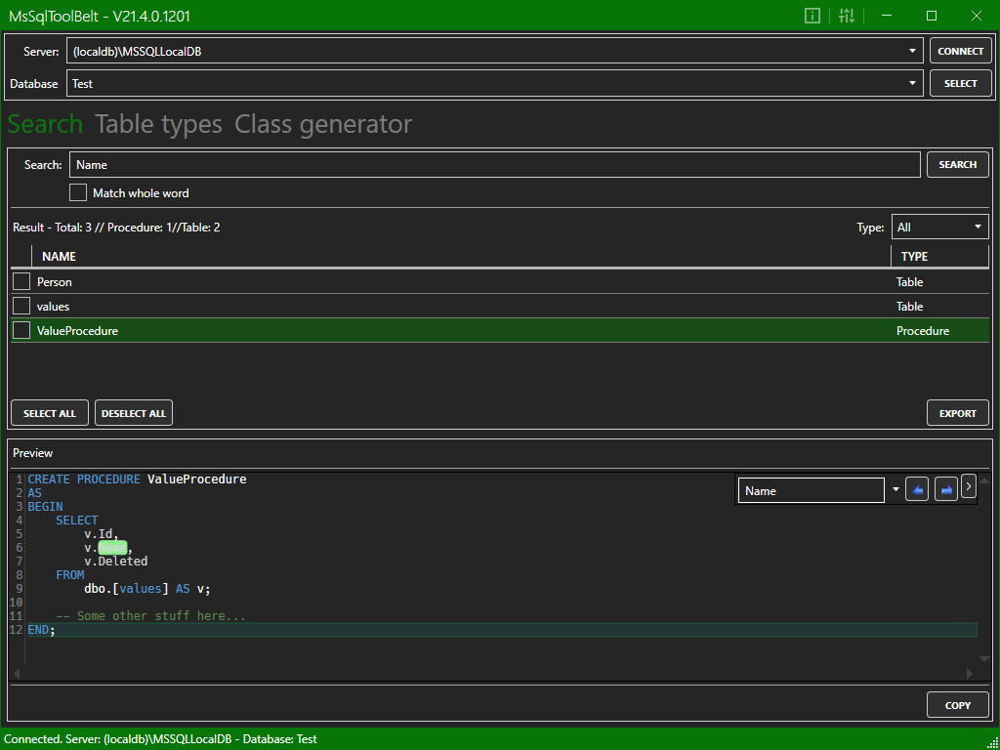
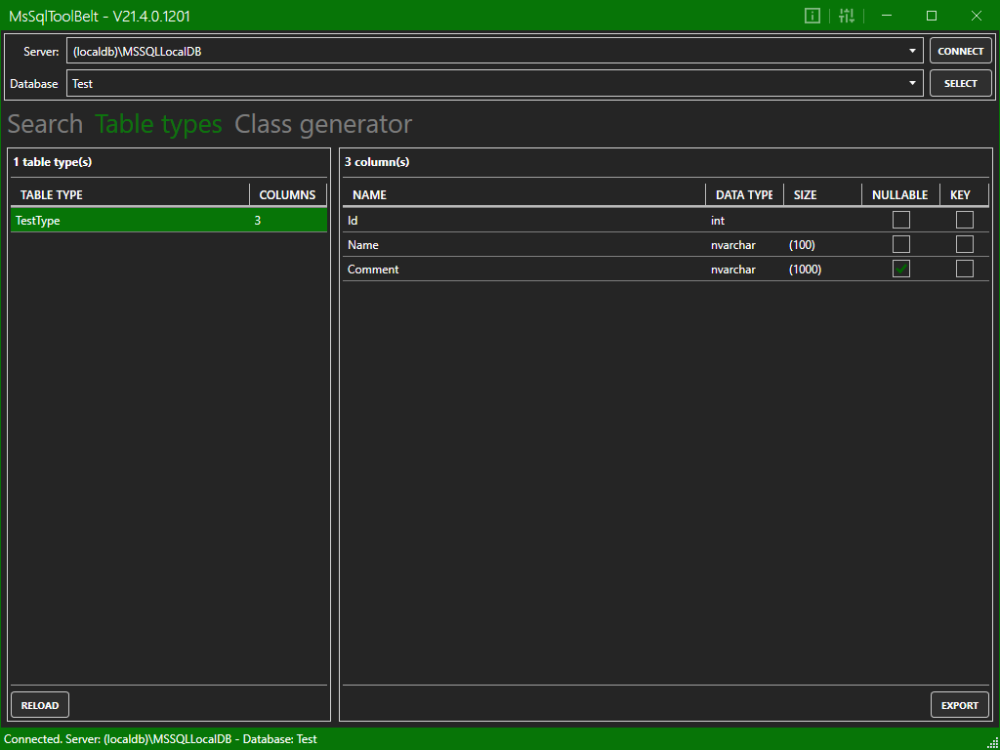
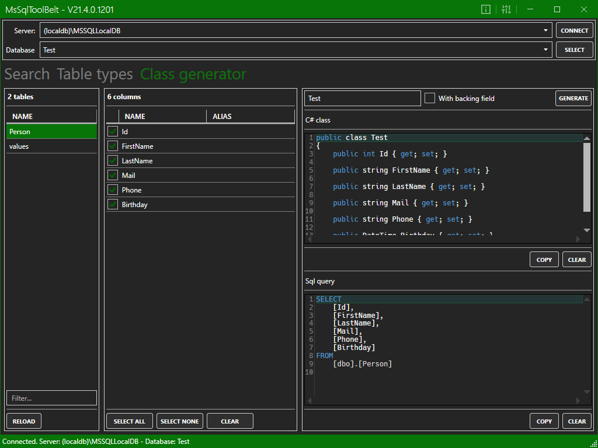

# MsSqlToolBelt

**Content**
<!-- TOC -->

- [General](#general)
- [Usage](#usage)
    - [Search](#search)
    - [Table types](#table-types)
    - [Class generator](#class-generator)

<!-- /TOC -->

## General
The program *MsSqlToolBelt* is a little helper tool which provides a search and a list of all custom table types of a MSSQL database.

## Usage
When you've started the program enter the name / path of the desired SQL server and hit *Connect*. After that you can selected the desired database. When you've selected the database hit *Select*.

Now you can start you search or discover the available table types.

### Search

Enter a search string and hit enter or the *Search* button. After that, you will see all matching entries.

The Button *Export* exports the definition of all selected entries.

### Table types

This tab shows all available *Table Types*. You can export the types 

### Class generator

This tab shows all available *Tables* to generate a C# class of it.
