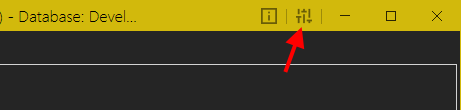
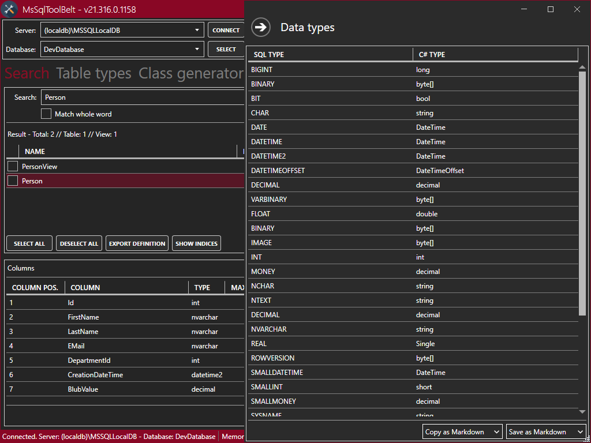
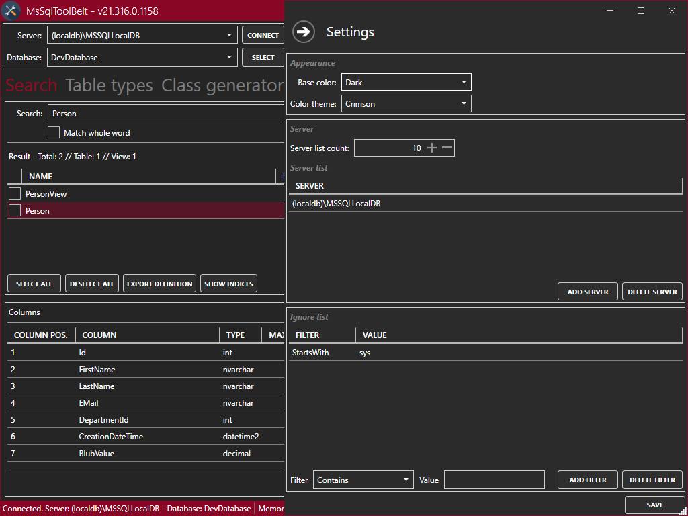
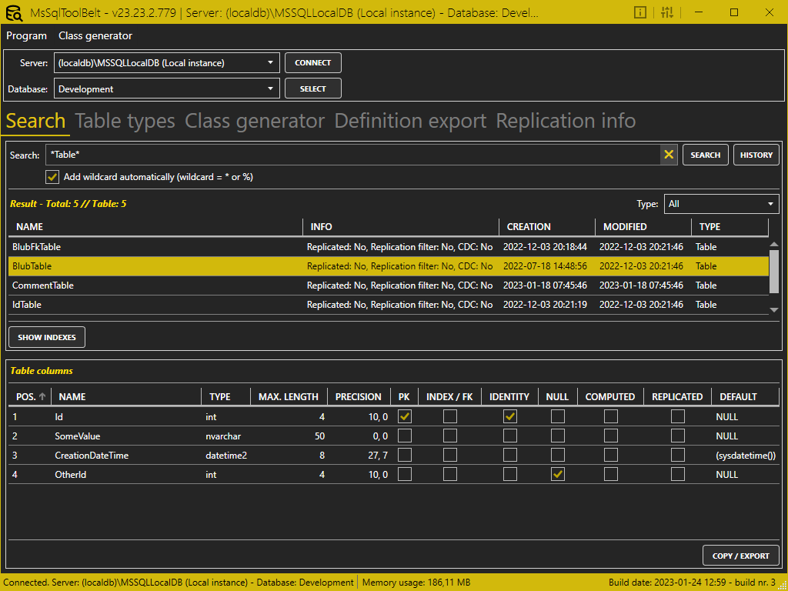
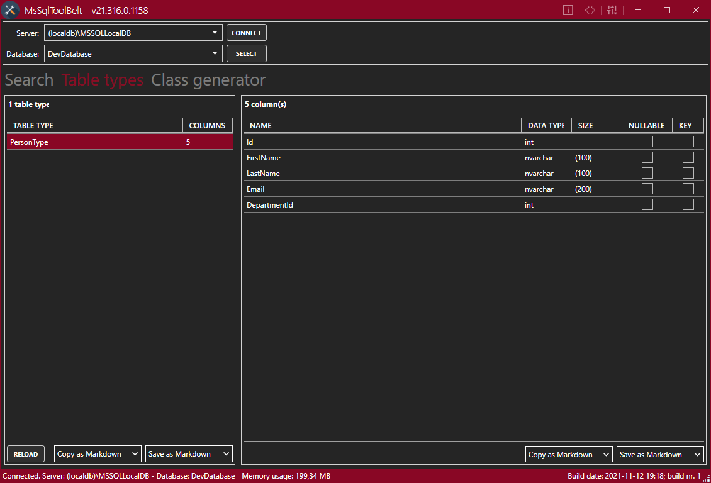
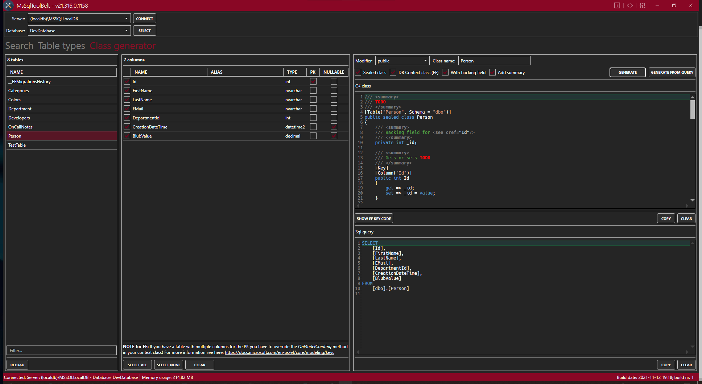
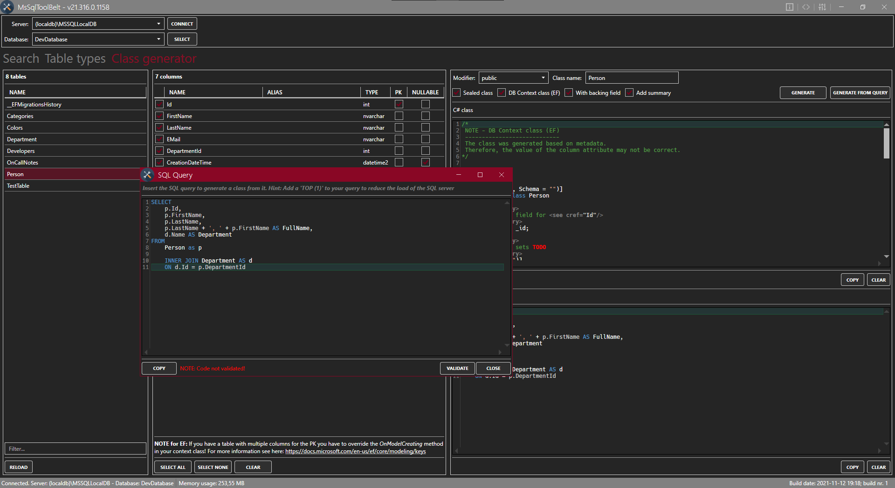

# MsSqlToolBelt

**Content**
<!-- TOC -->

- [General](#general)
- [Usage](#usage)
- [Info / Data types / Settings](#info--data-types--settings)
    - [Search](#search)
    - [Table types](#table-types)
    - [Class generator](#class-generator)

<!-- /TOC -->

## General
The program *MsSqlToolBelt* is a little helper tool which provides a search, a list of all custom table types of a MSSQL database and a C# class generator

## Usage
When you've started the program enter the name / path of the desired SQL server and hit *Connect*. After that you can selected the desired database. When you've selected the database hit *Select*.

Now you can start your search, discover the available table types or generate a C# class.

## Info / Data types / Settings

In the top right corner you can open:
- Information about the program

    

- A list of the data types

    

- The settings

    

### Search

Enter a search string and hit enter or the *Search* button. After that, you will see all matching entries.

Via the buttons *Copy as ...* / *Save as ...* you can copy / export the result / information as one of the following types:
- Markdown
- CSV
- ASCII formatted

### Table types

This tab shows all available *Table Types*. Via the buttons *Copy as ...* / *Save as ...* you can copy / export the list as one of the following types:
- Markdown
- CSV
- ASCII formatted

### Class generator

This tab shows all available *Tables* to generate a C# class of it. You can also insert a SQL query to generate a class from it

