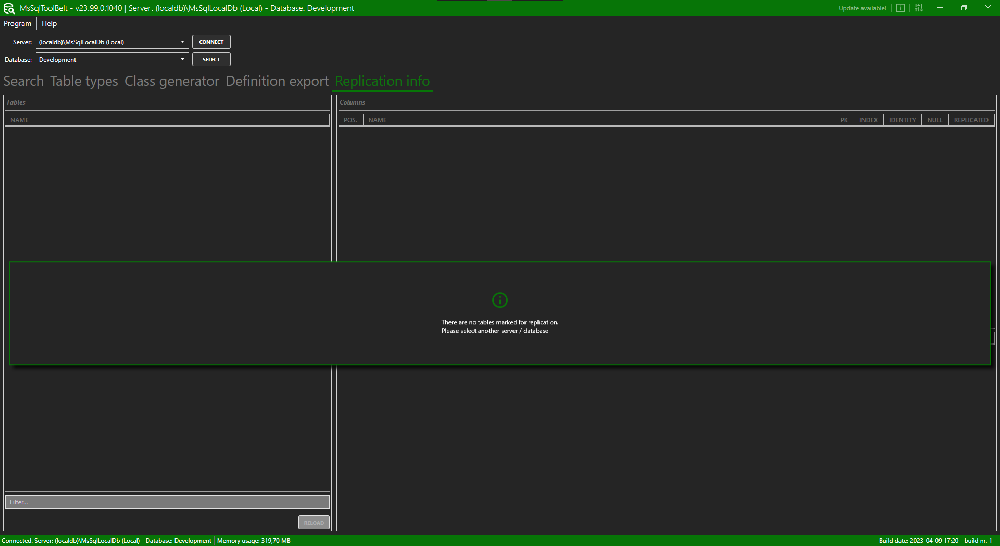

# MsSqlToolBelt

**Content**
<!-- TOC -->

- [General](#general)
- [Usage](#usage)
    - [Ui](#ui)
    - [Settings](#settings)
        - [New server](#new-server)
    - [Search](#search)

<!-- /TOC -->

## General
The program *MsSqlToolBelt* is a little helper tool which provides a search, a list of all custom table types of a MSSQL database and a C# class generator

## Usage

First of all, the usage of the *MsSqlToolBelt* is very straight forward 😎.

If you use the program for the first time, you have to add at least one database. You can find out how to do that here: [Settings](#settings)

### Ui

The UI (*User Interface*) of the if splitted into several different regions:

1. **Search**

    The search is the *main* part of the program. Here can you perform you search. For more information see [Search](#search)

    **SQL preview**

    

    **Table preview**

    

    

2. **Table types**

    Shows a list with all available *custom* table types.

    

3. **Class generator**

    Here you can generate a C# class out of a selected table or a query.

    

4. **Definition export**

    Here you can export the definition of objects / tables by select the desired object / table or insert a list of objects / tables.

    

5. **Replication info**

    Shows some replication information. 

    **Note**: Something is displayed here only if the database has replication.

    

6. **Settings / Info / Update**

    In these two fly outs you will find the settings and some information about the program.

    You can open the settings / info via the top menu:

    **Top menu**

    

    **Settings menu**

    

    **Info menu**

    

    **Update menu**

    

### Settings

The settings *fly out* splits into five several regions:

1. **Appearance**

    Here you can choose the color theme of the program.

2. **Sever list**

    Here you can maintain your SQL server. The following options are available:

    1. *Up*: Moves the selected server up one position in the list
    2. *Down*: Moves the selected server down one position in the list
    3. *Add*: Add a new SQL server to the list
    4. *Edit*: Edits the selected SQL server
    5. *Delete* Deletes the selected server

    For more information how about to add a server see [New server](#new-server)

3. **Ignore list**

    Here you can maintain the *ignore list*. If you want to ignore certain objects / tables in the search etc. you can add them here. There are several filter options available for this:

    - *Contains*: All entries which contains the *value* will be ignored
    - *Equals*: All entries which are equal to the *value* will be ignored
    - *Starts with*: All entries which starts the with the *value* will be ignored
    - *Ends with*: All entries which ends with the *value* will be ignored

    **Note**: Only the name of an object will be checked!

4. **Various**

    1. **Copy format**: If you select the contant of a list and hit CTRL + C the content will be copied in the desired format which can be set here.
    2. **Search history count**: The amount of entries which should be stored in the search history.

5. **Import / Export**

    Here you can import / export the current settings.

#### New server

1. Hit the *Add* button (bottom right)
2. In the dialog that opens, enter the desired / needed information:

    

    - *Server*: The name / path of the MS SQL Server. For example `(localdb)\MsSqlLocalDb`
    - *Database*: Select the *default* database. This database will be selected when you establish a connection to the desired server. You have to click *Connect* to load the list of available databases.
    - *Auto connect*: If this option is checked, a connection to the default (Option *Database) database will be established automatically.
    - *Name*: The name of the connection. The name will be shown in the selection dialog.

3. Hit *OK*

### Search

The search is really straight forward. Enter the desired search text and hit *Enter* or *Search*. The result will be shown in the list below. If you select an entry, more information will be shown below.

You can filter the result by the types (combo box on the right).

If you check the option *Add wildcard automatically (wildcard = * or %)* a wilcard will be automatically added to your search text.

For example:

Value: `Test`
Value with Wildcard: `*Test*`

The wildcard works as following:

| Example | Info |
|---|---|
| `Test` | Value must be equal with `Test`. |
| `*Test` | Value must end with `Test` |
| `Test*` | Value must start with `Test` |
| `*Test*` | Value must contain `Test` |